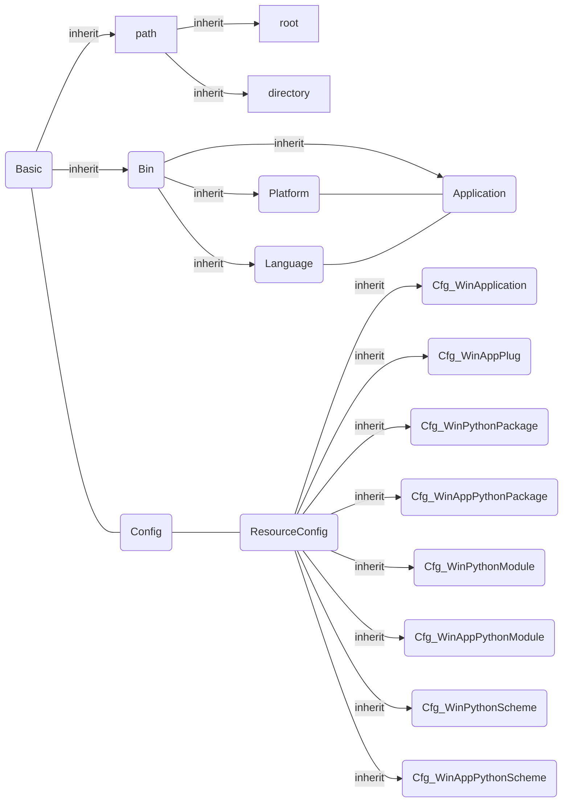
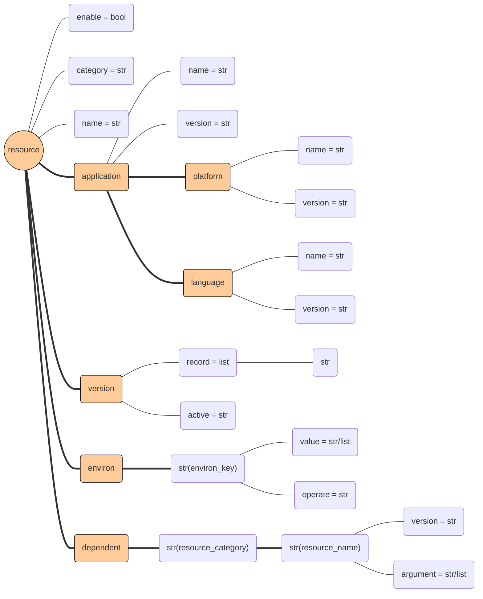

# Definition

## Resource

### Module



### Raw

- graph



- json

```json
{
    "enable": true, 
    "category": "windows_python_module", 
    "name": "LxWindows", 
    "application": {
        "name": "python", 
        "version": "2.7.x", 
        "application": {
            "version": "share", 
            "name": "windows"
        }, 
        "language": {
            "version": "2.7.x", 
            "name": "python"
        }
    }, 
    "environ": {
        "PATH": {
            "operate": "+", 
            "value": "{sourcepath}"
        }
    }, 
    "dependent": {
        "windows_bin": {
            "python": {
                "argument": "share"
            }
        }, 
        "windows_python_module": {
            "LxInterface": {
                "version": "active", 
                "argument": "2.7.x"
            }, 
            "LxUi": {
                "version": "active", 
                "argument": "2.7.x"
            }, 
            "LxCore": {
                "version": "active", 
                "argument": "2.7.x"
            }
        }
    }, 
    "version": {
        "active": "0.0.0", 
        "record": [
            "0.0.0"
        ]
    }
}
```
