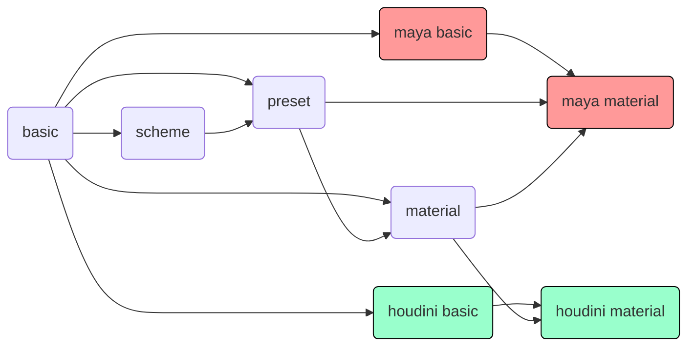
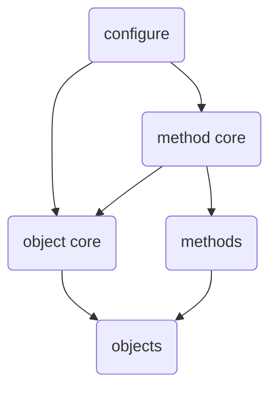
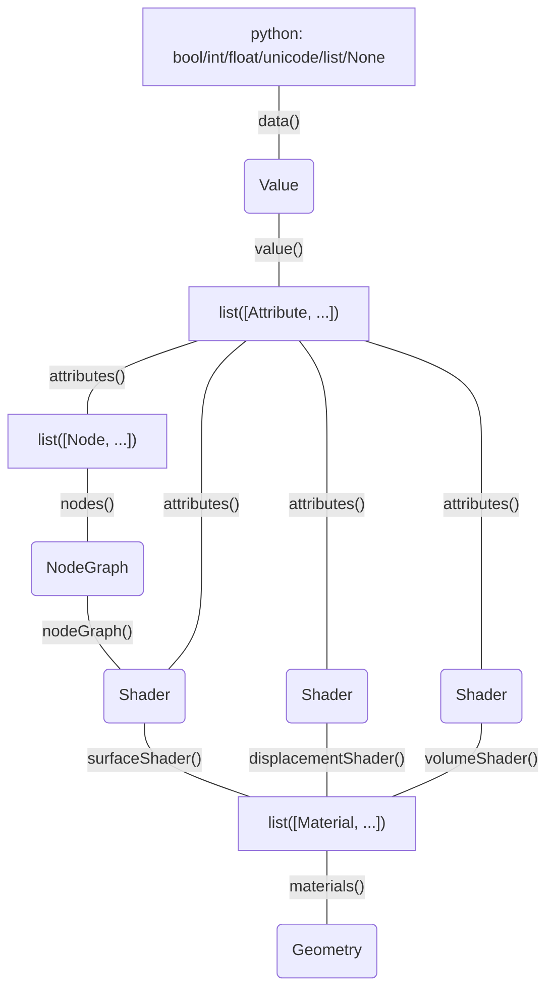

[TOC]

# project

## structure

- project
    - basic
    - scheme
    - preset
    - material

- maya project
    - maya basic
    - maya material
    
 - houdini project
    - houdini basic
    - houdini material

## relation

# module

## structure

- module
    - methods
        - sub method
        - ...
    - objects
        - sub object
        - ...
    - configure
    - method core
    - object core
    
### relation

### etc

- LxBasic
    - bscMethods
        - _bscMtdUtility
        - ...
    - bscObjects
        - _bscObjUtility
        - ...
    - bscConfigure
    - bscMtdCore
    - bscObjCore
    
## name

nodeString: "|namespace:name_0|namespace:name_1"

attributeString: "|namespace:name_0|namespace:name_1.portname_0.portname_1"

fullpathName: "|namespace:name_0|namespace:name_1.portname_0.portname_1"

namespacesep: ":"

nodesep: "|"

portsep: "."

name: "namespace:name_1"

fullpathPortname: "portname_0.portname_1"

portname: "portname_1"

# maya

## object

### relation

